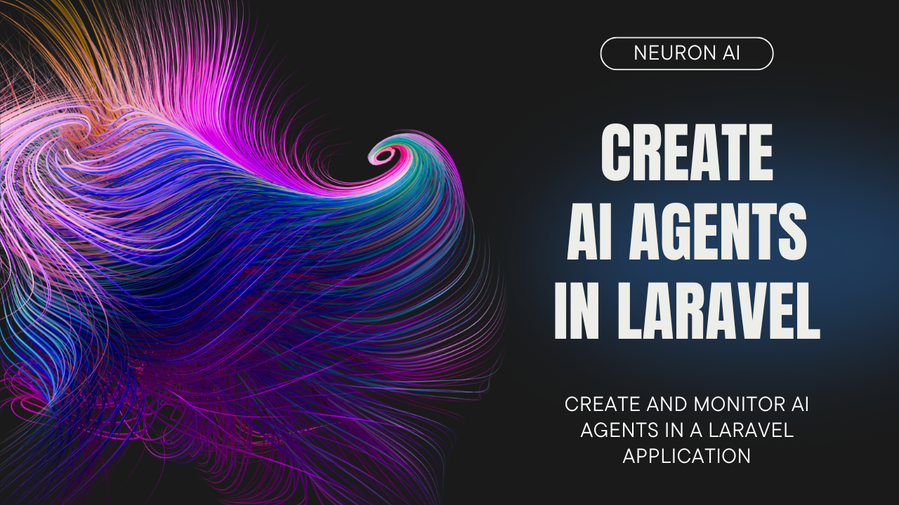

# Neuron AI - PHP AI Framework with Built-in Observability

[](https://packagist.org/packages/inspector-apm/neuron-ai)
[](https://packagist.org/packages/inspector-apm/neuron-ai)

> Before moving on, support the community by giving a GitHub star ⭐️. Thank you!

[**Video Tutorial**](https://www.youtube.com/watch?v=fJSX8wWIDO8)

[](https://www.youtube.com/watch?v=fJSX8wWIDO8)

## Project Overview

Neuron AI is a powerful PHP framework for creating full-featured AI agents as standalone components in any PHP application. It provides a comprehensive toolkit for building intelligent applications with built-in observability, RAG systems, structured output, and multi-provider support.

### Key Features

- **Multi-Provider Support**: Switch between LLM providers (Anthropic, OpenAI, Gemini, Ollama, etc.) with one line of code
- **Built-in Observability**: Monitor agent execution with Inspector integration
- **RAG Systems**: Implement Retrieval-Augmented Generation with vector stores
- **Structured Output**: Get structured responses from natural language inputs
- **Tool Integration**: Add function calling capabilities with toolkits
- **MCP Support**: Connect to Model Context Protocol servers
- **Memory Management**: Automatic conversation history and context management

## Class Diagram


## Installation

### Requirements

- PHP: ^8.1
- Composer

### Setup

Install the latest version of the package:

```bash
composer require inspector-apm/neuron-ai
```

### Optional Dependencies

For specific features, you may need additional packages:

```bash
# For AWS tools
composer require aws/aws-sdk-php

# For Elasticsearch vector store
composer require elasticsearch/elasticsearch

# For Typesense vector store
composer require typesense/typesense-php

# For Doctrine vector store
composer require doctrine/orm
```

## Usage

### Create an Agent

Neuron provides the `Agent` class that you can extend to inherit the main features of the framework. This class automatically manages advanced mechanisms like memory, tools, function calls, and RAG systems.

```php
<?php

namespace App\Neuron;

use NeuronAI\Agent;
use NeuronAI\SystemPrompt;
use NeuronAI\Providers\AIProviderInterface;
use NeuronAI\Providers\Anthropic\Anthropic;

class DataAnalystAgent extends Agent
{
    public function provider(): AIProviderInterface
    {
        return new Anthropic(
            key: 'ANTHROPIC_API_KEY',
            model: 'claude-3-sonnet-20240229',
        );
    }

    public function instructions(): string
    {
        return new SystemPrompt(
            background: [
                "You are a data analyst expert in creating reports from SQL databases."
            ]
        );
    }
}
```

The `SystemPrompt` class takes your base instructions and builds a consistent prompt for the underlying model, reducing the effort for prompt engineering.

### Talk to the Agent

Send a prompt to the agent to get a response from the underlying LLM:

```php
use NeuronAI\Chat\Messages\UserMessage;

$agent = DataAnalystAgent::make();

$response = $agent->chat(
    new UserMessage("Hi, I'm Valerio. Who are you?")
);
echo $response->getContent();
// I'm a data analyst. How can I help you today?

$response = $agent->chat(
    new UserMessage("Do you know my name?")
);
echo $response->getContent();
// Your name is Valerio, as you said in your introduction.
```

The Agent automatically maintains memory of the ongoing conversation.

### Add Tools and Toolkits

You can add abilities to your agent to perform concrete tasks:

```php
<?php

namespace App\Neuron;

use NeuronAI\Agent;
use NeuronAI\Providers\AIProviderInterface;
use NeuronAI\Providers\Anthropic\Anthropic;
use NeuronAI\SystemPrompt;
use NeuronAI\Tools\Toolkits\MySQL\MySQLToolkit;

class DataAnalystAgent extends Agent
{
    public function provider(): AIProviderInterface
    {
        return new Anthropic(
            key: 'ANTHROPIC_API_KEY',
            model: 'claude-3-sonnet-20240229',
        );
    }

    public function instructions(): string
    {
        return new SystemPrompt(
            background: [
                "You are a data analyst expert in creating reports from SQL databases."
            ]
        );
    }

    public function tools(): array
    {
        return [
            MySQLToolkit::make(
                \DB::connection()->getPdo()
            ),
        ];
    }
}
```

### MCP Server Connector

Instead of implementing tools manually, you can connect tools exposed by an MCP server:

```php
<?php

namespace App\Neuron;

use NeuronAI\Agent;
use NeuronAI\MCP\McpConnector;
use NeuronAI\Providers\AIProviderInterface;
use NeuronAI\Providers\Anthropic\Anthropic;

class DataAnalystAgent extends Agent
{
    public function provider(): AIProviderInterface
    {
        return new Anthropic(
            key: 'ANTHROPIC_API_KEY',
            model: 'claude-3-sonnet-20240229',
        );
    }

    public function instructions(): string
    {
        return new SystemPrompt(
            background: [
                "You are a data analyst expert in creating reports from SQL databases."
            ]
        );
    }

    public function tools(): array
    {
        return [
            // Connect to an MCP server
            ...McpConnector::make([
                'command' => 'npx',
                'args' => ['-y', '@modelcontextprotocol/server-everything'],
            ])->tools(),
        ];
    }
}
```

### Implement RAG Systems

For RAG use cases, extend the `NeuronAI\RAG\RAG` class instead of the default Agent class:

```php
<?php

namespace App\Neuron;

use NeuronAI\Providers\AIProviderInterface;
use NeuronAI\Providers\Anthropic\Anthropic;
use NeuronAI\RAG\Embeddings\EmbeddingsProviderInterface;
use NeuronAI\RAG\Embeddings\VoyageEmbeddingProvider;
use NeuronAI\RAG\RAG;
use NeuronAI\RAG\VectorStore\PineconeVectorStore;
use NeuronAI\RAG\VectorStore\VectorStoreInterface;

class MyChatBot extends RAG
{
    public function provider(): AIProviderInterface
    {
        return new Anthropic(
            key: 'ANTHROPIC_API_KEY',
            model: 'claude-3-sonnet-20240229',
        );
    }

    public function embeddings(): EmbeddingsProviderInterface
    {
        return new VoyageEmbeddingProvider(
            key: 'VOYAGE_API_KEY',
            model: 'voyage-large-2'
        );
    }

    public function vectorStore(): VectorStoreInterface
    {
        return new PineconeVectorStore(
            key: 'PINECONE_API_KEY',
            indexUrl: 'PINECONE_INDEX_URL'
        );
    }
}
```

### Structured Output

For scenarios where you need structured output from natural language:

```php
use App\Neuron\MyAgent;
use NeuronAI\Chat\Messages\UserMessage;
use NeuronAI\StructuredOutput\SchemaProperty;

// Define the output structure as a PHP class
class Person
{
    #[SchemaProperty(description: 'The user name')]
    public string $name;

    #[SchemaProperty(description: 'What the user loves to eat')]
    public string $preference;
}

// Talk to the agent requiring structured output
$person = MyAgent::make()->structured(
    new UserMessage("I'm John and I like pizza!"),
    Person::class
);

echo $person->name . ' likes ' . $person->preference;
// John likes pizza
```

## Configuration

### Environment Variables

Set up your environment variables for the providers you want to use:

```env
# Anthropic
ANTHROPIC_API_KEY=your_anthropic_api_key

# OpenAI
OPENAI_API_KEY=your_openai_api_key

# Voyage AI (for embeddings)
VOYAGE_API_KEY=your_voyage_api_key

# Pinecone (for vector store)
PINECONE_API_KEY=your_pinecone_api_key
PINECONE_INDEX_URL=your_pinecone_index_url

# Inspector (for monitoring)
INSPECTOR_INGESTION_KEY=your_inspector_ingestion_key
```

### Supported LLM Providers

With NeuronAI, you can switch between LLM providers with just one line of code:

- **Anthropic** - Claude models
- **OpenAI** - GPT models
- **OpenAI on Azure** - Azure-hosted OpenAI
- **Gemini** - Google's Gemini models
- **Ollama** - Local models
- **HuggingFace** - Open source models

### Vector Store Options

Choose from multiple vector store implementations:

- **Pinecone** - Cloud vector database
- **Chroma** - Open source vector database
- **Qdrant** - Vector similarity search engine
- **Elasticsearch** - Search and analytics engine
- **Typesense** - Fast typo-tolerant search
- **Meilisearch** - Fast search engine
- **File** - Local file-based storage
- **Memory** - In-memory storage
- **Doctrine** - Database storage with ORM

### Embeddings Providers

- **OpenAI** - Text embedding models
- **Voyage AI** - High-performance embeddings
- **Ollama** - Local embedding models

## Monitoring

Integrating AI Agents into your application means working with probability distributions, not just deterministic code. This makes reproducibility, versioning, and debugging real challenges.

Many agents built with NeuronAI contain multiple steps with multiple LLM calls, tool usage, and external memory access. As these applications become more complex, it's crucial to inspect what your agent is doing and why.

The best way to monitor your agents is with [Inspector](https://inspector.dev). After signing up, set the `INSPECTOR_INGESTION_KEY` environment variable:

```env
INSPECTOR_INGESTION_KEY=fwe45gtxxxxxxxxxxxxxxxxxxxxxxxxxxxx
```

After configuring the environment variable, you'll see the agent execution timeline in your Inspector dashboard.


## Contribution Guidelines

We welcome contributions to Neuron AI! Here's how you can help:

### Development Setup

1. Clone the repository
2. Install dependencies: `composer install`
3. Run tests: `composer test`
4. Run static analysis: `composer analyse`
5. Format code: `composer format`

### Coding Standards

- Follow PSR-12 coding standards
- Use PHP 8.1+ features
- Write comprehensive tests
- Use constructor property promotion
- Prefer named arguments for clarity
- Avoid annotations in favor of attributes

### Submitting Changes

1. Fork the repository
2. Create a feature branch
3. Make your changes
4. Add tests for new functionality
5. Ensure all tests pass
6. Submit a pull request

### Reporting Issues

When reporting issues, please include:

- PHP version
- Neuron AI version
- Error messages and stack traces
- Steps to reproduce
- Expected vs actual behavior

## License

This project is licensed under the MIT License - see the [LICENSE](LICENSE) file for details.

## Official Documentation

For comprehensive documentation, tutorials, and advanced usage examples, visit:

**[https://neuron.inspector.dev/](https://neuron.inspector.dev/)**

## Guides & Tutorials

Check out the technical guides and tutorials archive to learn how to start creating your AI Agents with Neuron:

**[https://docs.neuron-ai.dev/resources/guides-and-tutorials](https://docs.neuron-ai.dev/resources/guides-and-tutorials)**


