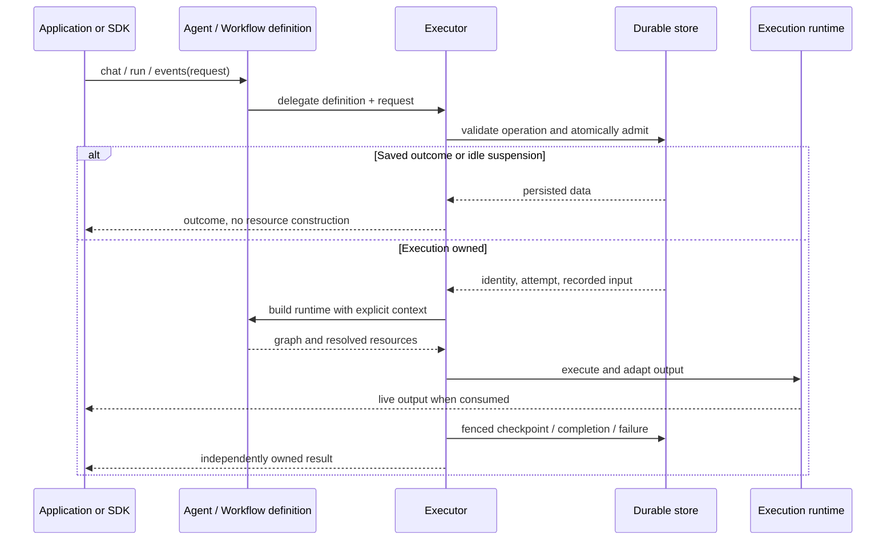

# Runnable definitions and isolated executions

Status: implemented engine separation; the final section records the concrete contract. SDK adoption remains pending.
Date: 2026-09-22.
Scope: Neuron AI Workflow and Agent, with integration boundaries for the native Cloud SDK and Laravel SDK.
Compatibility: direct breaking changes are permitted; no compatibility wrappers or second protocol.

The companion [implementation plan](WORKFLOW_EXECUTION_IMPLEMENTATION_PLAN.md) turns this architecture into ordered work and verification gates.

## 1. Objective

Keep the experience of building an agent or workflow as an entity and calling it:

```php
$agent = BIAgent::make(threadId: $conversationId)
    ->setAiProvider($provider)
    ->setTools([$searchTool]);

$result = $agent->chat(new UserMessage('Analyze our sales'));
$stream = $agent->stream(new UserMessage('Explain the results'));
```

Internally, the object describes executable behavior and configured defaults. Each invocation has a separate execution that owns identity, state, resources, graph instances, and progress.

The separation is about ownership, not forcing users to construct more objects. An Agent may delegate to an executor internally. Nesting that collaborator is not inherently a design problem. Letting that collaborator repeatedly rewrite the Agent's current run identity, input, state, and dependencies is the problem to remove.

The following examples describe the target API shape. Existing convenience names are intentional; new hook signatures and internal type names are proposals to finalize together before implementation. They are not claims about APIs already present in this checkout.

## 2. The durable problem, in ordinary terms

A BI agent can receive a question, request approval for a tool, save progress, and stop. An approval later arrives in another process. That process has no access to the original PHP objects.

It must recover two different things:

1. The facts of the work: its conversation and run, original messages and inference options, completed steps, pending interruption, and accepted answer.
2. The ability to perform the remaining work: provider clients, tools, history access, nodes, middleware, and output resources.

Persistence retains the first. The application's definition reconstructs the second. A third concern, execution ownership, determines which worker may commit progress when deliveries overlap.

The engine uses durable step results, checkpoints, and memoization. It does not preserve a PHP stack across requests or automatically make every external side effect exactly once. An unfinished node may run again; uncertain external calls need their own idempotency where necessary.

The architecture must make these concerns meet in a clear order without temporarily turning the workflow definition into the running process.

## 3. Pre-refactor implementation and remaining coupling

The current checkout already has explicit [ExecutionRequest](src/Workflow/Executor/ExecutionRequest.php) values and deterministic terminal return types. Mutable start/resume/signal staging and the synthetic preparation event have been removed.

The deeper separation has not happened:

| Current location | Current responsibility | Problem to resolve |
| --- | --- | --- |
| [Workflow](src/Workflow/Workflow.php) | Definition hooks plus current run ID, start event, state, graph map, restoration and execution flags | One object describes behavior and stores one execution's live data. |
| [ResolveState](src/Workflow/ResolveState.php) | Memoizes the current state on Workflow | A later invocation can mutate an object returned by an earlier invocation. |
| [HandleComponents](src/Workflow/HandleComponents.php) | Configuration plus cached executor, stream adapter and channel | Definition lifetime and execution-resource lifetime are mixed. |
| [WorkflowExecutor](src/Workflow/Executor/WorkflowExecutor.php) | Admission, identity adoption, graph startup, traversal, persistence and settlement | It modifies the definition through a large runtime interface before execution. |
| [WorkflowRuntimeInterface](src/Workflow/WorkflowRuntimeInterface.php) | Definition access plus mutable execution collaboration methods | Workflow implements both the application API and the live engine runtime. |
| [Agent](src/Agent/Agent.php) | Agent graph plus history/thread adoption, inference input and runtime restoration | Runtime identity and services are reconciled by mutating the Agent. |
| [HandleTools](src/Agent/HandleTools.php) | Tool configuration plus expanded tool cache and derived instructions | Execution-derived information can survive on a reused definition. |

The current `prepareExecution()` hook detects identity/input mutation around an application callback. That is a safeguard around this object model, not a fundamental durability primitive. The target removes the need for that callback to finish configuring the Workflow after the executor has modified it.

This document supersedes the preparation and ownership design in the earlier [local orchestration plan](LOCAL_ORCHESTRATION_IMPLEMENTATION_PLAN.md). Its durability requirements remain valid. The current implementation and its tests are a migration baseline, not code to discard wholesale.

## 4. Architectural decisions

1. **Workflow and Agent remain runnable definitions.** Keep inheritance, `make()`, fluent configuration, node composition, and convenient execution methods.
2. **One invocation creates one transient execution.** A durable run can span several such execution segments and processes.
3. **Execution identity does not migrate back into the definition.** Returned state and inspection expose runtime facts; definition getters expose declared configuration only.
4. **Construct runtime resources from explicit context.** Factories return resources or a graph. They do not receive a mutable Workflow to patch.
5. **Keep admission and persistence authority in the engine.** SDKs cannot reimplement a check-then-start sequence outside the atomic store.
6. **Keep platform policy in SDK orchestrators.** Cloud envelopes, delivery records, retries, reporting, queue dispatch, and registration stay outside the engine.
7. **Keep output consumption explicit.** `run()` is eager; `events()` and Agent `stream()` are lazy regardless of channels.
8. **Do not promise shared-instance concurrency as part of this refactor.** Preserve the current same-facade overlap protection initially. Different instances and processes continue to coordinate through persistence fencing.

## 5. Objects and their lifetimes

These are responsibilities, not a requirement for a class per table row.

| Concept | Lifetime | Owns | Must not own |
| --- | --- | --- | --- |
| `Workflow` / `Agent` | Configured definition, reusable sequentially | Graph/resource recipes, configured overrides, default address, persistence/serializer policy, execution strategy, initial-state recipe | Adopted run/attempt identity, current input/state, live graph, pending command, per-segment caches |
| `ExecutionRequest` | One caller operation, retained for retries | Start or continuation intent, optional explicit address, reserved/expected run ID, expected attempt, operation key, response payload | Clients, closures, channels, mutable control records |
| `ExecutionContext` (new) | One admitted segment | Authoritative workflow ID, run ID, engine attempt, original input snapshot and durable domain context | Mutable business state, SDK delivery object, credentials, container, ownership mutation methods |
| `WorkflowExecution` (new, internal) | One live segment | Context, mutable state, graph/routing map, resolved dependencies, restoration behavior, output pipeline | Long-lived application configuration, scheduler, Cloud reporting |
| Executor and `WorkflowRunStore` | One active invocation | Admission, control snapshot, lease/CAS authority, traversal, branch coordination, settlement | A definition's current-run cache or application transport policy |
| `WorkflowState` / `AgentState` result | One returned outcome | That outcome's data and execution metadata | A pointer to a reusable definition's next invocation |
| `WorkflowRunSnapshot` | One inspection result | Observed persisted status, run/attempt and interruption | Permission to execute without revalidation |

Use the existing `WorkflowExecutor` as the admission/execution coordinator unless implementation demonstrates a concrete need for another class. “Runner” describes its role; do not add a second public `WorkflowRunner` hierarchy merely to match terminology.

An executor with mutable control/store/branch fields cannot be reused across overlapping invocations. Prefer a fresh executor from a configured strategy factory for each invocation, preserving sequential and AsyncExecutor behavior. Persistence connections and stateless services can remain shared application dependencies.

## 6. Preserve the developer experience

### 6.1 Agent convenience methods

```php
$agent = BIAgent::make(threadId: $conversationId)
    ->setAiProvider($provider)
    ->setPersistence($persistence);

$first = $agent->chat(new UserMessage('First question'));
$firstRunId = $first->getRunId();

$second = $agent->chat(new UserMessage('Second question'));

assert($first->getRunId() === $firstRunId);
assert($first->getRunId() !== $second->getRunId());
```

Each convenience call creates a request and delegates. It does not install messages or inference mode into the definition's current start event. `structured()` still returns the typed structured value. A direct `run($request)` returns AgentState, including structured output where applicable.

Keep state return values rather than introducing a mandatory result wrapper. Make them independently owned snapshots with respect to later invocations, including nested mutable data. This does not require making every public state setter immutable.

### 6.2 Streaming and push delivery

```php
$stream = $agent->stream(new UserMessage('Explain the result'));

foreach ($stream as $event) {
    // Consume native output or adapted protocol events.
}

$result = $stream->getReturn();
```

Constructing the generator performs no admission, resource construction, provider calls or frame delivery. Iteration executes and also publishes to a configured channel.

A worker that wants eager streamed inference uses the same definition:

```php
$request = ExecutionRequest::start(
    event: new AgentStartEvent($messages, new AgentRunOptions(stream: true)),
    runId: $reservedRunId,
    idempotencyKey: $deliveryId,
);

$result = $agent->run($request);
```

Provider streaming mode and caller consumption remain separate decisions. A channel never changes the terminal's return type. No Cloud event-stream service is introduced; Pusher and compatible application-managed channels remain valid.

### 6.3 Workflows remain entities too

```php
$workflow = OrderWorkflow::make(workflowId: $orderId)
    ->setPersistence($persistence);

$result = $workflow->run();
```

Keep fluent `addNode()` / `addNodes()` and configured initial-state input. They define node prototypes/recipes and a state seed, not live nodes/state to reuse indiscriminately. Custom workflow subclasses still describe graphs through hooks. Nodes keep their event-and-state invocation experience wherever possible.

### 6.4 Approvals and reconstructed processes

```php
$agent = BIAgent::make(threadId: $conversationId)
    ->setPersistence($persistence);

$request = $agent->submitApprovalDecisions(
    ['call_123' => 'approve'],
    idempotencyKey: $deliveryId,
);
$result = $agent->run($request);
```

The helper inspects persisted interruption data, translates the answer, and returns a request carrying the observed address/run/attempt. Creating it does not construct a provider, tool executor, or output stream. Preserve the request for retries instead of translating again against a later interruption.

A raw fenced continuation remains available through `ExecutionRequest::resume(...)`. A fresh process reconstructs the same definition and storage configuration; it does not reconstruct a half-initialized Agent and then repair it.

### 6.5 Runtime information

| Developer need | Target source |
| --- | --- |
| Configured conversation/default address | Agent/Workflow definition configuration |
| Actual address of an unkeyed execution | Returned state's workflow ID |
| Run ID and attempt that produced a result | Returned state or admitted ExecutionContext |
| Currently persisted interruption/status | `inspect()` with a bound or explicit address |
| State during a node | Node argument / NodeContext |
| Resource construction identity | ExecutionContext argument |

Remove definition `getRunId()` and “current state” accessors rather than returning whichever invocation happened last. If `getWorkflowId()` remains, define it as the declared/bound default only. It must not silently adopt a generated address from execution. A configured seed is not exposed as the current result.

## 7. Identity and input before resource construction

The meanings remain unchanged:

- Workflow ID is the stable persistence partition/business address; for addressed Agents it is the conversation thread.
- Run ID identifies one generation/turn under that address. It may be reserved by a caller or generated by the engine.
- Execution attempt is an engine-assigned ownership fence. It is not a Cloud delivery attempt.
- The operation key identifies one logical input delivery while its run's receipts remain stored.

Add an optional explicit workflow address to requests. Bound convenience definitions use their configured default. A request address that contradicts a bound definition is rejected before writes; use a separately bound definition to switch conversations. A plain unbound start may generate an address; an unbound continuation must supply the prior result's address.

For native translation helpers, freeze the inspected address into the returned request as well as run/attempt. A later configuration change must not redirect that translated answer to another partition.

Admission establishes authoritative identity before context-dependent resources are resolved. Resume uses persisted ignition, never current definition defaults for original messages, stream mode or structured-output options. Reserved start identity is not evidence that initialization succeeded.

Read-only PHP properties do not make an Event or Message graph deeply immutable. Capture start intent as a data snapshot at invocation creation. Context exposes that authoritative input as a detached value/read view; it must not expose a mutable alias to persisted intent. The executor uses its own working event when traversal requires mutable event objects. Keep the current Agent fingerprint normalization for generated message IDs.

## 8. Construct resources instead of patching the definition

A target Agent can declare context-dependent resources:

```php
class BIAgent extends Agent
{
    protected function chatHistory(string $threadId): ChatHistoryInterface
    {
        return new SQLChatHistory($this->database, threadId: $threadId);
    }

    protected function streamAdapter(ExecutionContext $context): StreamAdapterInterface
    {
        return new AGUIAdapter($context->workflowId, $context->runId);
    }

    protected function channel(ExecutionContext $context): StreamingChannelInterface
    {
        return new PusherChannel($this->pusher, $this->outputRoute);
    }
}
```

`database`, `pusher`, and `outputRoute` are constructor/fluent configuration. The hook creates a resource for a supplied context; it never obtains identity from a mutable “current run” on `$this`. Ordinary provider/tools/instructions overrides remain the same conceptual extension mechanism; adjust signatures deliberately where context is needed.

The engine calls a definition-building boundary with ExecutionContext. That boundary resolves resources once for this execution, constructs nodes/middleware, and returns a runtime. It does not assign them back to the definition.

For dynamic SDK configuration, support resource factories where a prebuilt instance is insufficient: for example, a channel factory receiving ExecutionContext and returning a channel. A factory is a dependency recipe, not an orchestration callback receiving Workflow. Keep factory support limited to actual context-dependent needs and settle setter names in the contract phase. Existing object setters remain useful for configured application services and sequential use.

Resource lifetime rules:

| Resource | Treatment |
| --- | --- |
| Persistence, serializer, database connection, base provider client | Application-configured service; do not serialize or deep-clone live connections. |
| Resolved history access | Bound to the authoritative conversation for this execution; shares the conversation's external history, not execution state. |
| Expanded tool registry and derived instructions | Execution-local; rebuilding must not modify definition instructions or accumulate toolkit guidance. |
| Node instances and routing map | Built per segment; registered instances are prototypes with explicit copy/factory semantics. |
| Adapter and channel | Segment-local construction preferred; explicitly supplied instances may be reused only under their documented sequential reset contract. |
| Middleware | Definition registration stays reusable; invocation context and mutable middleware state must not leak to another execution. |

Do not solve arbitrary object cloning through serialization of clients or closures. For stateful/uncloneable node prototypes, use a construction factory or an explicit supported clone contract. Do not silently run and mutate the configured prototype itself.

No generic guarantee of concurrent reuse follows from these rules. Distinct definitions can still explicitly share an unsafe service; this refactor does not make third-party clients thread-safe.

## 9. Execution flow and ownership



For a lazy call, the sequence begins during consumption. The request and its input are captured when the invocation is created. Definition configuration is resolved during execution setup. All setters configure subsequent executions without a mutation assertion; an active execution keeps its already resolved resources, graph, middleware, completion policy and dispatcher. Listener registration preserves the registry captured by existing dispatchers. The executor captures persistence, serializer and lease settings before admission. RAG builds its default retrieval strategy per segment using the currently configured embeddings and vector store; an explicitly supplied strategy remains a shared service. Switching history selects the next conversation without redirecting an active segment's history or durable writes. Restoration hooks must use execution context and resolved resources instead of changing definition settings. This is not a deep clone of clients or closures, and directly mutating a shared service is outside the setter contract. Keep the executor's local usage gate for overlapping execution and cleanup operations, separate from durable ownership. Creating a lazy invocation does not itself start another segment.

Detailed segment ordering:

1. Resolve address and storage policy without graph construction or live resource hooks.
2. Validate/fingerprint the request and read operation/control records.
3. Return a saved outcome, or handle a non-executing suspension poll, without constructing runtime resources.
4. Atomically initialize or claim the generation and bind the accepted input/receipt. Validate run and attempt fences.
5. Create ExecutionContext from authoritative identity and recorded original input.
6. Construct execution-local state/resources/graph. Restore executable dependencies in recalled events/state using that runtime.
7. Validate the graph, reset/start output adaptation, execute nodes and replay committed steps as appropriate.
8. Persist a fenced suspension, completion, or failure; emit the appropriate output terminal and return the outcome.
9. Release transient resources/usage guards when consumed or discarded. Generator destruction alone must not unconditionally delete or release durable ownership.

Resource construction is not itself business execution. Its ordering after admission prevents unnecessary work on saved deliveries and provides authoritative context. A provider call, tool execution, history mutation, or publication is an effect and must not occur merely during definition construction or manifest generation.

Setup failure after a successful claim belongs to that run/attempt and is durably recorded. Refused admission cannot mark another worker failed. Adapter failures before the first node must not advance traversal accidentally. Channel transport failures retain the current ChannelError isolation policy.

## 10. Existing durability guarantees to retain

The split changes in-memory ownership, not the correctness model:

- Atomic control/ignition/operation initialization, including caller-reserved run IDs.
- Atomic acceptance of a continuation and its operation receipt.
- Saved outcomes replay without providers, tools, graph construction or stream frames.
- Retries of unfinished operations preserve accepted input and committed work.
- Generation/attempt and byte-exact control fencing for every step, memo, checkpoint, outcome and deletion.
- Existing leases and refusal of overlapping live workers; no claim of exactly-once external effects.
- One current interruption, accepted answers, deadlines, and ordered deferred parallel interruptions.
- Retained completion through reporting, exact-run acknowledgement, and attempt-fenced abandonment.
- Receipts end when the run is cleaned up; post-cleanup deduplication remains a coordinator responsibility.
- Agent protection against abandoning unanswered tool calls and explicit conversation reset semantics.

Prefer preserving the existing persistence primitives and stored records. Breaking changes are allowed, but do not redesign storage just to move runtime state between PHP objects. If a record shape must change, document the local-data reset or direct migration explicitly; do not introduce versioned readers.

## 11. Class and interface boundaries

`Workflow` should stop implementing the live `WorkflowRuntimeInterface`. The interface should be reduced to the methods execution machinery actually needs and implemented by the execution runtime. Definition construction/fingerprinting methods belong to a definition boundary, not the live runtime.

| Current capability | Target location |
| --- | --- |
| `make()`, fluent setters, configured default address, graph/resource hooks | Workflow/Agent definition facade |
| `run()`, `events()`, `chat()`, `stream()`, `structured()` | Thin facade methods delegating to one engine path |
| Run ID, attempt, authoritative input | ExecutionContext |
| `getState()` / `setState()`, graph map, node lookup, resolved middleware | WorkflowExecution |
| `adoptIdentity()` / `adoptIgnition()` on Workflow | Remove; create an execution context/runtime from admitted records instead |
| `prepareExecution()` and terminal `prepare:` callback | Remove; replace with explicit resource/graph construction using context |
| `finishExecution()` on Workflow | Executor/runtime cleanup; no definition identity to clear |
| `restoreEvent()` / `restoreState()` | Composition-specific execution restoration, supplied by Agent runtime/builder |
| Stream adaptation and channel lifecycle | Execution runtime, with failure settlement delegated to engine authority |
| `inspect()`, translate inputs, acknowledge, abandon | Facade delegates to engine control operations using explicit/bound address and observed fences |
| Fresh state and input creation | Definition recipes that produce new values; no memoized current state |

Keep `NodeContext` as the step-level context. It already carries the current state, event, input and memoizer. ExecutionContext describes the run/attempt and original input, not a competing replacement for NodeContext.

Observability must carry authoritative execution metadata without reading a mutable Workflow's last run. Audit event `source` users and exporters; keep access to definition identity/class for presentation, and provide runtime identity/state explicitly. Exporting an execution-dependent graph requires an explicit context/preview input; never acquire a durable run just to export it.

## 12. First-party platform integration

### Cloud platform

Cloud continues to reserve identity, issue commands, route durable interruptions, and own delivery/report/finalization state. There is no new protocol version and no Cloud stream channel. The in-process split should not require changing the wire contract merely because PHP classes moved.

### Native PHP SDK

An application orchestrator remains useful for registration, pure construction/configuration of a definition, business-payload mapping, and platform-facing notifications. It must not stage execution on the definition or call eager Agent methods to prepare input.

The target path is: resolve orchestrator -> construct a configured definition -> freeze/map request data -> invoke engine -> report returned outcome -> finalize exact-run cleanup. Resumes use recorded original intent. Definition construction receives application configuration and any permitted per-delivery routing configuration; authoritative engine identity reaches resource factories through ExecutionContext.

Revisit the previous SDK `configureExecution(Workflow, ExecutionContext): void` proposal. Do not carry it forward as an engine callback that patches a live workflow. Move that behavior into definition resource recipes configured by the orchestrator. SDK delivery context and engine ExecutionContext have different ownership; do not merge them into a catch-all context bag.

### Laravel SDK and app-demo

Laravel resolves orchestrators and definitions through its container, binds services, and schedules SDK processing. It does not implement another admission/replay lifecycle.

The app-demo BIAgent keeps its normal Agent subclass experience. Its orchestration layer maps chat starts and approval replies into requests. Its history and local AG-UI/Pusher-compatible output resources use explicit execution context. Application conversation records may retain UI/domain data; they should not be needed merely to ferry engine run identity between registration and a later start callback.

## 13. Boundaries against accidental redesign

This work does not add a scheduler, workflow language, general DI container, mandatory trait, public execution-handle hierarchy, permanent event history, transport replay store, or Cloud streaming service.

Do not replace the preparation callback with a generic callback receiving both Workflow and context. A context-aware dependency factory must return a dependency or runtime; it must not mutate the definition into an execution.

Do not remove standalone convenience methods to make internal layering easier. Do not add an invisible “last execution” pointer to recover removed getters. Do not shallow-clone the whole Workflow and declare the responsibilities separated while all existing runtime fields remain on it.

## 14. Acceptance criteria

The redesign is successful when all of these are true:

- Ordinary users still build Workflow/Agent subclasses or fluent instances and invoke them directly.
- A definition has no adopted run ID, current state, current start event, resolved graph or segment resource cache.
- Two sequential results remain independent, including state metadata and nested mutable values.
- Fresh-process approval continuation restores input and resources from explicit context without a Workflow-mutating callback.
- Saved/idle deliveries need no graph, provider, history or output setup.
- Native and Cloud-managed invocations use the same engine execution path.
- Context-dependent output starts only after authoritative identity and owned runtime construction, including zero-output nodes.
- Existing durability, tool approval, channel isolation and cleanup invariants continue to pass focused checks.
- Exact public contracts, resource ownership and intentional breaking changes are documented with runnable examples.

## 15. Decisions to close during contract review

The direction above is fixed for this proposal. Before implementing new APIs, close the following narrow choices using code spikes and tests:

1. Exact namespaces and public/internal visibility for ExecutionContext and WorkflowExecution; reuse the existing executor coordinator rather than add an unnecessary runner hierarchy.
2. Exact hook/factory signatures, including context-dependent providers/tools, fluent object overrides, and custom node prototype construction.
3. A supported detached input/state copy contract for PHP 8.1 and custom subclasses; no reliance on shallow `readonly` alone.
4. Address arguments on requests, inspection, and cleanup; handling of explicitly bound history/default conversations without runtime identity adoption.
5. Observability source/metadata and graph-export access after definition runtime getters disappear.

These are implementation design checkpoints, not permission to retain the old mutable preparation design as a fallback.

## Implemented contract (runner branch)

The engine split is now implemented. `WorkflowExecution` implements the reduced
runtime interface; `AgentExecution` owns its resolved resources and derived tools/
instructions. `WorkflowExecutor` remains the single admission/traversal coordinator.
No facade clone, preparation callback, or last-execution pointer is retained.

Graph hooks receive `WorkflowExecution` (Agent hooks document `AgentExecution`).
Provider/tools/instructions and output hooks receive `ExecutionContext`. History
uses the narrower `chatHistory(string $threadId)` because it is also needed for
conversation inspection/reset without an admitted run. The default in-memory Agent
configures a conversation address at construction; custom durable histories should
receive an explicit address or be supplied through `setChatHistory()`. Unbound plain
workflows adopt no generated address and return it only on results.

Requests expose detached `event()` / `payload()` values and support `workflowId:`.
Context exposes detached `startEvent()` / `domain()` values. Data copying uses PHP
serialization; live service instances are never copied that way. Node and middleware
prototypes follow PHP clone contracts, with explicit factories for uncloneable or
intentionally shared services. Custom state subclasses must clone owned mutable
properties for branch and returned-state isolation. Shared clients/tools remain
application capabilities, not durable snapshot data or a concurrency guarantee.

Observability keeps the definition as lifecycle `source` and adds explicit
`execution` metadata to lifecycle and node events. Graph export constructs a preview
graph without admission or output factories; the default preview has run ID `preview`
and attempt zero. Lazy input is captured immediately, configuration at consumption.

SDK and app-demo adoption are still downstream work.
