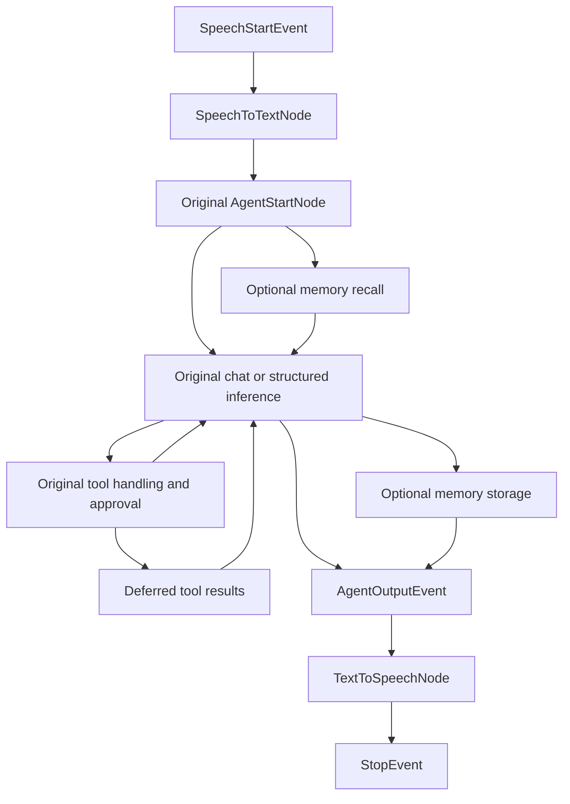

The speech experiment now uses Agent's `AgentOutputEvent` and `exitNodes()` hook. Speech input and output are two ordinary nodes; the Agent subclass owns their wiring while callers retain `chat()`, `stream()`, tool approvals, history, memory, and recovery.

Run from the repository root:

```bash
php examples/agent/speech-agent/demo.php
vendor/bin/phpunit -c phpunit.xml.dist examples/agent/speech-agent/SpeechAgentTest.php
vendor/bin/phpstan analyse examples/agent/speech-agent/{DemoSpeechAgent.php,SpeechAgentTest.php,bootstrap.php,demo.php,Events,Nodes,Stub} --autoload-file=examples/agent/speech-agent/bootstrap.php --no-progress --memory-limit=512M
```

The demo uses fake providers: its “audio” is base64-encoded text with an explicit fake media type, not playable speech. It tests orchestration rather than speech quality or external provider I/O. The bootstrap loads this folder without changing Composer configuration.

The caller experience stays small:

```php
$agent = DemoSpeechAgent::make();
$state = $agent->chat(new UserMessage(new AudioContent(
    base64_encode('Hello from the microphone.'),
    SourceType::BASE64,
    'application/x-fake-speech',
)));

$text = $state->getMessage()->getContent();
$audio = $state->get('speech.audio');
```

`DemoSpeechAgent.php` extends `Agent` directly and configures two protected provider hooks returning the existing `AIProviderInterface`, alongside the normal LLM `provider()` hook. Both speech nodes use their provider's `chat()` method. The repository's OpenAI and ElevenLabs speech providers implement this interface, although each provider's concrete media requirements still apply: the current OpenAI transcription implementation opens the content as a file path, so the fake base64 text is not a real recording suitable for that implementation.

The executed graph is:



`SpeechToTextNode` replaces audio blocks with transcripts while preserving block order, message metadata, and the caller's original message. It emits the original `AgentStartEvent`, so the original `AgentStartNode` initializes the request and options. It also clears the previous turn's audio artifact. `TextToSpeechNode` reads the completed assistant response, memoizes synthesis, stores `speech.audio`, and returns `StopEvent`.

The subclass now needs only this output wiring:

```php
protected function exitNodes(): array
{
    return [new TextToSpeechNode($this->textToSpeech())];
}
```

This replaces the default `AgentEndNode`, which handles the same `AgentOutputEvent`. Including both would register duplicate handlers. Multiple output steps need distinct connecting event types; their array order does not connect them.

Compared with the original experiment, the refactor removes three replacement subclasses, a `run()` interception trait, and a speech-specific completion event. There is no override of `nodes()`, no reconstruction of built-in node dependencies, and no special handling of the three possible finishing nodes. Chat, streaming, structured output, and optional memory storage now share the same output boundary. Graph export sees the inference-to-output edges directly; the memory node describes its generator completion edge explicitly.

The focused tests cover mixed input, multiple audio blocks, metadata preservation, streamed text followed by final audio, tool approval/resume, memory enabled and disabled, synthesis failure/recovery, a reconstructed Agent instance, stale-audio cleanup, structured output, middleware, duplicate-handler rejection, and graph export. Permanent regression coverage for the generic output hook lives in `tests/Agent/AgentOutputTest.php`.

The architecture's strengths are preserved:

- Callers do not coordinate speech events or steps. Approval continuation still uses `submitApprovalDecisions()->run()`.
- The original inference, tools, history, and memory implementations are reused intact.
- Speech providers are live node dependencies rebuilt per execution segment, rather than serialized into state.
- A failed output step can recover without repeating committed transcription, inference, or memory storage. The reconstructed-instance tests share persistence/history services and exercise restoration; they are not separate-process integration tests.
- Transcripts enter history and memory, while synthesized audio remains a separate output artifact.

The remaining tradeoffs are explicit:

- TTS runs after final inference and optional memory storage. If synthesis fails, the text exchange is already committed. Use `run()` to recover that turn; `chat()` starts a new turn.
- Streaming preserves text chunks, but synthesis starts after the final response. Low-latency overlapping speech needs a separate buffering, cancellation, and audio-streaming design.
- `structured()` still returns its typed object. This experiment speaks raw JSON; natural narration would require an explicit mapping. Audio remains accessible through `getState()`.
- The input hook remains compatible with `AgentStartEvent`, because the Agent's convenience methods directly access messages and options.
- Some fluent setters return `AgentInterface`, hiding subclass members and Workflow methods from static analysis. Tests keep the concrete instance in a variable and configure it separately.
- Output extensions still need explicit composition and ordering. The exit hook makes that composition local to the Agent definition; it does not automatically combine independently installed extensions.
