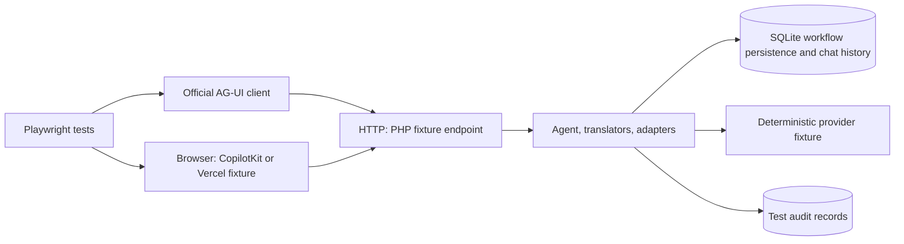

# Frontend protocol integration testing

Status: proposed architecture; the JavaScript and browser suite described here is not implemented.

This document describes how to verify Neuron's frontend-tool integrations with AG-UI, CopilotKit, and the Vercel AI SDK. It supersedes the earlier protocol assessment and carries forward its unresolved findings as explicit investigations for this suite.

## The problem

Neuron can suspend an Agent while a frontend executes a tool, accept its result, and continue inference. Streaming adapters publish the request in a frontend protocol; input translators turn the frontend response into workflow inputs. These pieces must agree with the actual clients across several HTTP requests.

The existing PHP tests check tool execution, approvals, durable interruptions, translation, and emitted frames. The frontend flow tests also reconstruct an Agent between requests. However, those tests construct client payloads themselves. Both sides of a PHP test can share the same incorrect interpretation of an external protocol.

A valid-looking stream does not prove that a client will execute a tool, display an approval, retain the right call identity, or submit the next request. Likewise, a translator accepting a handcrafted payload does not prove that the frontend library produces that payload. Automatic continuation can stop unexpectedly or submit repeatedly even when every individual frame passes a schema check.

The new suite must prove this observable outcome:

> A real frontend client receives a tool call from Neuron, executes or rejects it through its supported APIs, returns the outcome over HTTP, and displays the Agent's continuation. The next provider request contains the correct tool outcome, and previously completed work is not repeated.

This covers protocol interoperability, not model quality. It must run without a paid model, an external AI service, or interactive browser permission prompts.

## Where the implementation stands

The inbound translators and subsequent outbound changes address the main implementation gaps identified during the earlier assessment. The remaining questions concern interoperability and application behavior that the new suite can investigate.

| Area | Current position | Remaining evidence |
|---|---|---|
| Deferred execution | Approval gate, local/deferred separation, durable results wait, and accumulated results exist | Exercise them through real clients and HTTP requests |
| Inbound translation | Shared `InputTranslatorInterface`, native translators, AG-UI and Vercel translators exist | Verify payloads generated by the supported SDK versions |
| Application continuation | `Workflow::submitInputs()` performs translation and stages continuation; `events()` executes it | Verify endpoint routing and error behavior in a realistic application |
| Dynamic definitions | AG-UI input can produce `DeferredTool` definitions | Test schemas produced by the actual frontend registration API |
| Outbound lifecycle | Call identity, approval dispatch, stream parts, continuation context, and snapshot handling have been revised | Verify client state and callbacks, not only PHP frame assertions |
| Retries and reloads | Durable workflow state and adapter context provide building blocks | Establish the complete client/application contract and its limits |

There is enough implementation to begin the suite. There is no need to add another framework abstraction first. Failures may reveal focused implementation changes, but this proposal does not authorize new public APIs.

The unresolved findings are tracked below. Removing the earlier assessment does not mean these findings are resolved: each requires executable evidence and, where necessary, an implementation correction or an explicit documented limitation.

## Architecture

Keep the existing PHP tests as the fast foundation. Add a dedicated integration harness with two complementary layers:

1. **SDK contract tests:** use public JavaScript client APIs and exported schemas to consume real PHP responses and send continuations. These catch invalid frames, unsupported fields, identity mismatches, and incorrect request shapes without requiring a rendered application.
2. **Browser journeys:** mount small React applications using the real frontend hooks. Exercise registration, approvals, execution, automatic continuation, errors, and reloads in Playwright.

Use Playwright as the initial runner for both layers: ordinary tests can run SDK code without a page, while browser projects use its page fixtures. An additional JavaScript test framework is unnecessary initially.



The PHP endpoint is a small example application around Neuron. It uses the real Agent, workflow executor, input translators, stream adapters, persistence, and chat history. Only the AI provider is replaced with deterministic behavior. Browser tools should execute ordinary browser code, such as reading `document.title`.

This fits Neuron's architecture: components are composed in an application fixture, while the workflow engine remains protocol agnostic. The suite should not add HTTP-server responsibilities to `Agent` or couple the engine to React.

AG-UI and CopilotKit need separate projects. Passing the AG-UI client tests establishes protocol behavior; it does not establish the behavior of CopilotKit's registration hooks or automatic orchestration. CopilotKit registers frontend tools through component lifecycle, and exposes interrupts through a separate hook. [Frontend tools](https://docs.copilotkit.ai/reference/hooks/useFrontendTool), [interrupts](https://docs.copilotkit.ai/reference/hooks/useInterrupt).

## Proposed layout

The following paths are proposed, not existing suite files:

```text
tests/Integration/Frontend/
    README.md
    package.json
    package-lock.json
    playwright.config.ts
    backend/
        router.php
    Stub/
        AgentFactory.php
        ScenarioProvider.php
    fixtures/
        copilotkit/
        vercel/
    specs/
        agui/
        copilotkit/
        vercel/
    support/
```

PHP fixtures should follow the repository's test namespaces and `Stub` convention. Share scenario setup, backend observation, and persistence helpers. Keep each client's wiring explicit: hiding both frontends behind one artificial client interface would conceal precisely the differences we need to test.

Use the documented CopilotKit runtime/agent wiring required by the chosen release. If that wiring requires a small runtime bridge, include it in the fixture and test it. Do not assume its React hooks can point directly to an arbitrary PHP endpoint without that integration.

Playwright can manage the frontend and PHP servers, wait for readiness, and stop them after execution. CI should start fresh processes rather than reuse an unrelated development server. [Playwright web servers](https://playwright.dev/docs/test-webserver).

## The PHP application fixture

### One request must not depend on the previous PHP object

Construct a fresh Agent and adapter for every request. Retain workflow state and chat history in a test-specific SQLite database using Neuron's persistence and history implementations. Create the required tables during setup.

Use a stable thread identity across a journey. Keep frontend run identifiers, Neuron run identifiers, tool-call identifiers, and engine interrupt identifiers distinct. Assertions should verify their relationships rather than assume these identifiers are interchangeable.

Route a new user turn through the Agent's normal streaming entry point. Route a tool result or approval through `submitInputs($payload, $translator)->events()`. An invalid continuation must produce an error; it must not fall back to starting a new turn.

The fixture should distinguish these operations from the actual protocol request and the application's conversation state. Test controls such as scenario selection must remain separate from protocol fields. Do not introduce a special result envelope that bypasses the inbound translator merely to make a test pass.

### Definitions and conversation context are application responsibilities

For AG-UI, load the client-declared definitions from the request and apply the fixture's explicit tool policy before attaching them. Reject collisions with stable backend tools. Re-supply definitions where approval continuation or future inference requires them. Dynamic registration and unregistration must be tested through the frontend API. AG-UI carries frontend tool declarations in run input. [AG-UI tool flows](https://docs.ag-ui.com/concepts/tools).

For Vercel, begin with matching backend declarations and frontend implementations. A universal client-supplied tool catalog is not a prerequisite for the documented client-tool flow, and the suite should not invent one. [Vercel tool usage](https://ai-sdk.dev/docs/ai-sdk-ui/chatbot-tool-usage).

Seed each adapter with the frontend conversation context needed to continue existing messages and parts. Do not append the client's entire conversation to Neuron's history on every result submission. The tests must inspect both histories for duplicate calls and results.

### Test the transport too

Serve the actual SSE response with the required headers and flushing. Vercel's UI message stream requires `x-vercel-ai-ui-message-stream: v1`; this is an endpoint responsibility, not currently part of the adapter interface. [Vercel stream protocol](https://ai-sdk.dev/docs/ai-sdk-ui/stream-protocol).

Distinguish an HTTP failure before streaming starts from an error after response headers have been sent. Test fragmented delivery, including split UTF-8 sequences, without assuming that one network chunk equals one protocol event.

A test-only observation endpoint or audit reader can expose persisted outcomes for assertions. It must not require a new public `Agent::inspect()` method. Internal executor inspection, if needed by the harness, remains test infrastructure.

## Deterministic scenarios and isolation

Each test receives a unique thread and database. Browser state and server-side audit records are isolated between tests and workers. A targeted restart test should reopen the same database after restarting the backend process.

The provider fixture should select its response from the actual inference input and the scenario's expected phase. For example, it first requests two tools, then produces a final answer only when both expected outcomes appear in the provider messages. Unexpected inference input should fail the scenario with a useful diagnostic.

Do not reset an in-memory response queue on every HTTP request. Likewise, do not advance the model scenario by counting HTTP requests: approval and partial-result submissions may not invoke the provider at all. Persist provider invocation records so tests can detect extra inference or replayed work.

Record local tool executions on the backend and frontend handler executions in the fixture. Assert counts alongside the final answer. The final UI alone cannot prove that a local side effect was not repeated during continuation.

Use observable state changes and bounded assertions instead of fixed sleeps. Browser API stubs, where necessary, should replace only the permission-dependent operation; they should not replace the frontend library, HTTP transport, or Neuron continuation.

A single PHP development server handles requests sequentially. It cannot prove behavior under simultaneous workers. Keep concurrency coverage in the engine suite, and use two independent backend processes sharing persistence if adding a specific concurrent HTTP scenario.

## Required coverage

For successful journeys, let the frontend library generate its normal requests. Handcrafted payloads are appropriate for malformed-input and adversarial tests, but must not substitute for a real client in the happy path.

| Scenario | What the test must prove |
|---|---|
| One deferred tool | Browser handler runs; its result reaches the next provider request; final UI completes |
| Approval followed by execution | Handler does not run before approval; dispatch happens after suspension is durable; execution occurs once |
| Approval rejection | Browser handler never runs; inference receives the rejection and continues |
| Mixed local and deferred tools | Local work runs once and is not executed by the browser; results reach inference in the correct call association |
| Two calls with the same tool name | Calls and outcomes remain distinct by call ID across requests |
| Partial and out-of-order results | Supported partial submissions preserve accepted results, keep pending work visible, and do not repeat completed work |
| Structured results | Objects, arrays, `false`, `0`, and `null` survive the protocol boundary with the documented normalization into model messages |
| Error and cancellation | Supported error/cancel operations settle the wait and reach inference as failures |
| Frontend handler throws | The fixture's error reporting path returns a tool failure rather than leaving an invisible permanent wait |
| Dynamic registration | The schema sent by the real client is accepted; component availability affects later tool exposure |
| Continued conversation | Existing tool parts/results are not duplicated; another inference step does not cause an automatic submission loop |
| Reload and backend restart | Saved client context can reconnect to the persisted wait; completed backend work is not rerun |
| Repeated, conflicting, or stale input | Retries have the documented outcome; conflicts and old-generation inputs cannot silently settle unrelated work |
| Stream boundaries | Text, reasoning, tool-only responses, and fragmented SSE produce valid client state and terminal behavior |

Partial native tool results and AG-UI standard interrupts have different contracts. Test the former where supported; test that an explicit AG-UI interrupt resume covers the required open interrupt set. Do not force the same submission strategy onto both. [AG-UI interrupts](https://docs.ag-ui.com/concepts/interrupts).

For Vercel, include the integration guide's automatic-submission predicate for mixed approval and tool-result batches. Verify both that continuation happens when required and that it does not loop. A suite using only manual submission would miss this application-facing behavior.

## Open questions the suite will investigate

All four remaining areas can be analyzed with this suite. They are part of its scope, rather than prerequisites that need a separate assessment before implementation.

| Open question | Investigation in the suite | Expected evidence |
|---|---|---|
| Real-client verification | Run the official AG-UI client and the CopilotKit/Vercel hooks through the complete HTTP lifecycle | Client-generated continuations, correct UI state, and the expected outcome in the next provider request |
| AG-UI error representation | Parse error responses with the official SDK and inspect client state after live events and snapshots | Whether the error survives each path, or a reproducible case requiring an adapter correction |
| Client-generated schemas | Register tools through the real frontend API and pass the generated declarations into Neuron | Which declarations work, which are rejected, and any required converter changes or documented restrictions |
| Retry and reload behavior | Repeat submissions, send conflicting or stale inputs, reload the browser, and restart the backend | Observed deduplication, identity, and recovery behavior, including where application policy is required |

Tests establish behavior for the selected clients and scenarios. They cannot choose application policies such as whether to retry a browser side effect whose result was lost. Record each finding as verified behavior, a reproducible implementation gap, or a documented application responsibility. Keep unresolved cases visible until that disposition is established.

### AG-UI error representation

The adapter currently adds an `error` value to its tool-result representation and carries it into `TOOL_CALL_RESULT`. The documented event fields list `messageId`, `toolCallId`, `content`, and `role`; a tool message's error representation does not automatically establish an equivalent event extension. [AG-UI events](https://docs.ag-ui.com/concepts/events).

Check the selected SDK's exported schemas and resulting client message state. Merely accepting the frame is insufficient: a client may discard an unknown field. Establish how an error survives live delivery and snapshots, then make the smallest adapter correction if needed.

### Schemas emitted by frontend libraries

The schema-to-property conversion supports a subset of JSON Schema. It does not currently provide general support for references, composition keywords, or tuple schemas. Test actual schemas generated by the selected frontend library, including required properties, nested objects, arrays, and nullable values.

If a normal supported declaration generates an unsupported construct, decide whether to extend the converter or document a precise restriction. Do not silently weaken the declaration to get a passing test.

### Retries, identity, and reload ownership

`submitInputs()` binds translation to the run and execution attempt observed during submission. That protects the interval between reading and continuing a run; it is not automatically a durable HTTP idempotency contract for an old browser request delivered after a later run begins.

Test accepted duplicates, conflicts, and stale requests separately, including reused call IDs across generations. Establish whether the protocol identity available to the translator is sufficient or whether application request identity must participate. Any resulting public API proposal requires separate review.

Reload tests must state where frontend context is saved and restored. The current components do not imply an SSE replay buffer or exactly-once browser execution after a disconnect. A browser side effect may have completed while its result submission was lost. Document the application's retry/idempotency responsibility rather than promising behavior the protocol cannot establish.

Likewise, cancellation and expiry need an explicit policy. The suite should test configured behavior, not invent an automatic deadline. Edited tool arguments and unsupported generic-interrupt cancellation should remain explicit limitations unless separately implemented.

## CI and compatibility policy

Create a separate Linux integration job with one supported PHP version and a selected Node LTS version. Install only the extensions and services needed by the fixture. Do not multiply the browser suite across the existing PHP dependency/runtime matrix.

Commit exact dependency resolution in a lockfile and use `npm ci`. Pin the runner and install its matching browser build. Record the tested versions of AG-UI, CopilotKit, Vercel AI SDK, React, Node, PHP, and the browser in test artifacts. Choose and verify the initial compatible package set when implementing the harness.

Run the contract tests and a small Chromium journey set on pull requests. Add a separate scheduled upgrade check that resolves newer compatible frontend dependencies and runs the same tests. Its failures should be visible and its resolved versions retained, while normal pull requests stay reproducible. Major frontend upgrades require a deliberate compatibility review.

On failure, retain the Playwright trace, browser errors, HTTP requests, chronological SSE frames, relevant client state, and backend invocation/history records. Use synthetic data only. Prefer assertions on meaningful state and identifier relationships over snapshots of entire streams containing generated IDs.

A passing pinned suite supports a compatibility claim for that package combination. It does not establish support for every historical release, every browser, or every possible application endpoint.

## Implementation order and completion criteria

1. Select and lock the frontend packages. Build the shared PHP fixture and one real-client tool round trip for each integration. Verify final UI state and provider input, not only a successful HTTP response.
2. Add approval acceptance/rejection, mixed execution, same-name calls, structured results, and automatic continuation. Resolve the AG-UI error representation with executable evidence.
3. Cover partial results, dynamic schemas, reloads, retries, stale inputs, and backend restart. Record unsupported behavior explicitly rather than hiding failures with retries or skipped tests.
4. Add the pull-request job and scheduled dependency check. Document local execution, tested versions, fixture responsibilities, and remaining limitations.

The initial suite is complete when the supported lifecycle passes through real clients, persisted continuation works across fresh backend instances, failures are diagnosable, and the documented compatibility scope matches the evidence. Every open question tracked here must have a test or an explicit disposition in this document.
